# 🛍️ Flutter Ecommerce App

> A cross-platform **Ecommerce App** built with **Flutter** — a modern mobile shopping experience with catalog browsing, cart management, and checkout flow.

---

## 📦 Project Overview

This repository contains a Flutter-based E-commerce application that enables users to:
- Browse products
- Add items to the cart
- Manage cart items
- View product details
- Authentication & user profile
- Checkout flow

The app is highly customizable and built using popular Flutter packages (`Provider`) for state management, networking, UI, and local persistence.

---

## 🚀 Features

🛒 Browse & search products  
🛍️ View product details  
➕ Add to cart & remove from cart   
🤍 Add to wish list and remove from wish  
💰 Cart total price calculation  
💳 Online payment gateway integration using sslcomerz  
📈 Product categories & filtering  
🔄 State management with **Provider**  
🚫 Graceful handling of empty states  
🔐 User authentication  
🛠️ Uses modern Flutter packages  

---

## 📸 Screenshots / UI Preview
 ### Splash / Welcome
  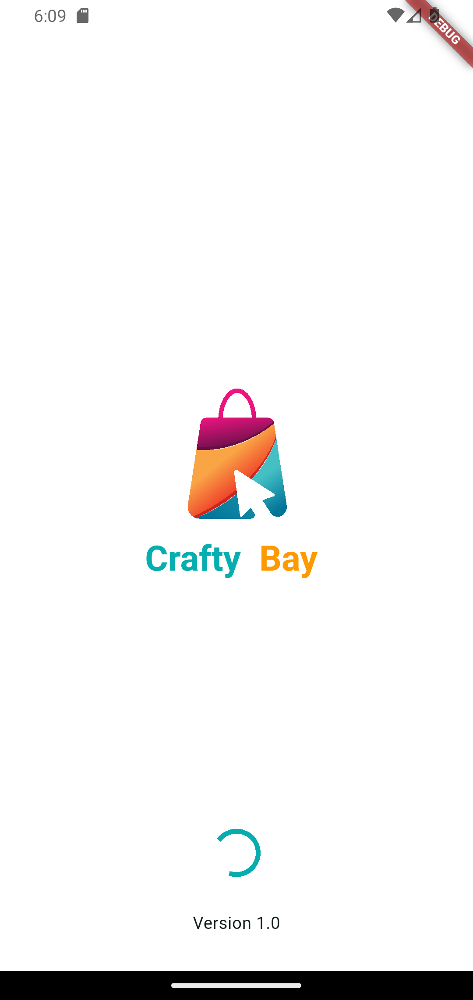

### 🔐 Login Screen

  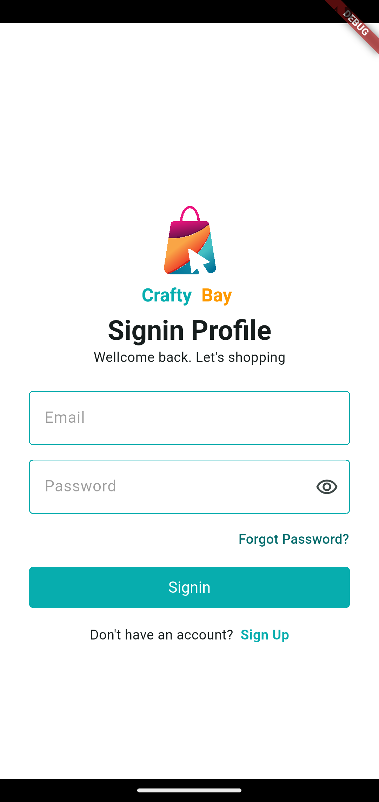
  

### 🔐 Home Screen

  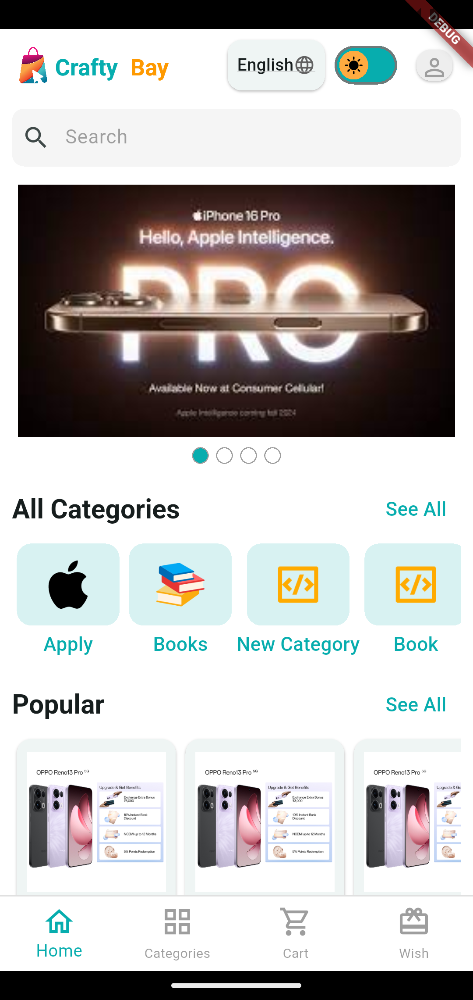
  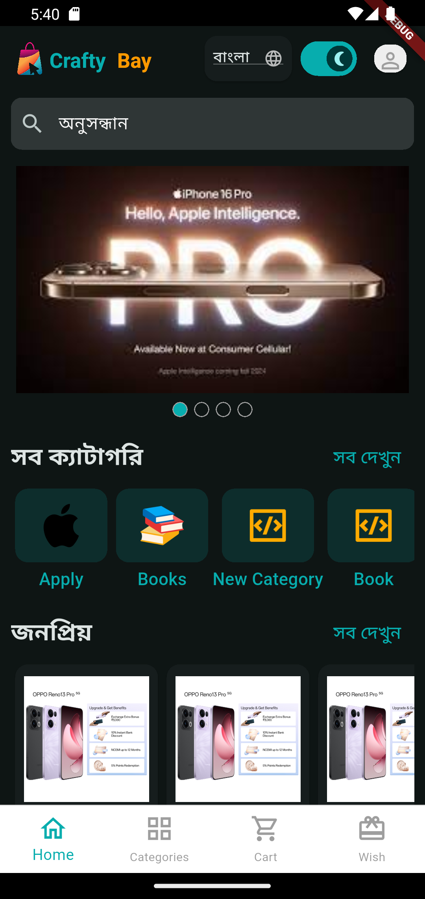

### 🔐 Product List Screen

  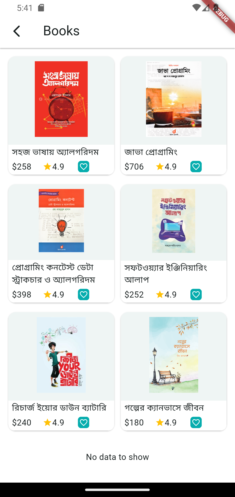
  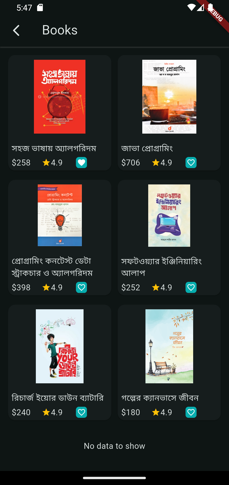

### 🔐 Product Details Screen

  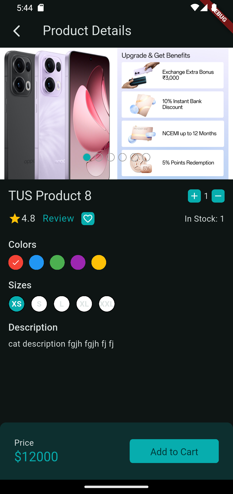
  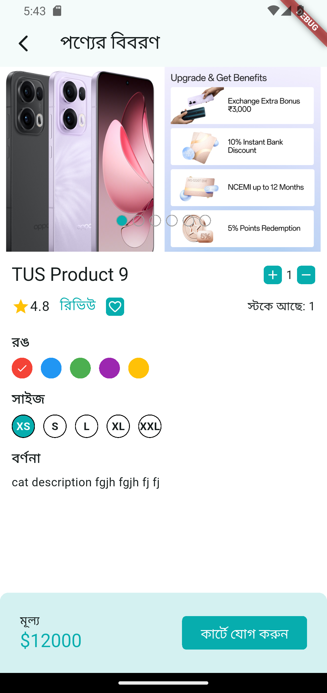

### 🔐 Cart Screen

  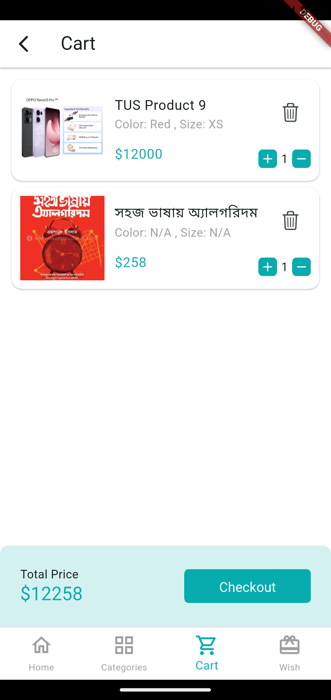
  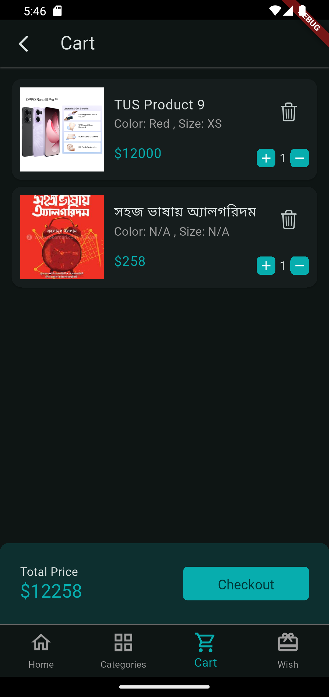

### 🔐 Checkout Screen
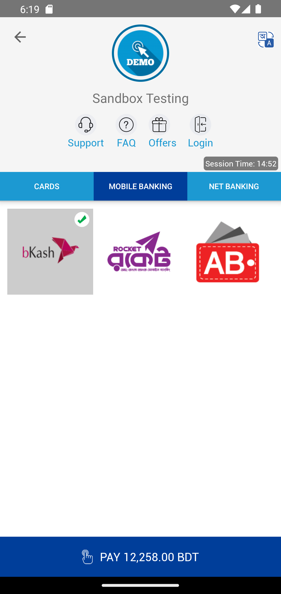

---

## 📦 Tech Stack & Key Packages

| Category | Used Packages |
|----------|----------------|
| State Management | `provider` |
| API & Networking | `http` |
| Local Storage | `shared_preferences` |
| SVG Assets | `flutter_svg` |
| Carousel / UI Helpers | `carousel_slider` |
| Input Handling | `pinput` |
| Localization | `intl` |
| Payment Gateway | `flutter_sslcommerz` |
| Misc | (Other packages found in pubspec.yaml) |

---

## 👨‍💻 Author

Developed by: `Rahimujjaman Rahim`     
💙 Built with Flutter and passion.

#### ⭐ If you find this project helpful, please give it a star on GitHub!
